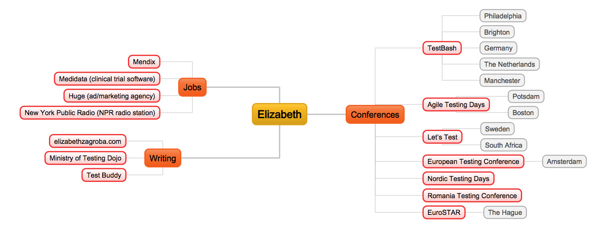

## Wander With A Purpose
### Writing Charters for your Exploratory Testing Sessions
#### Elizabeth Zagroba

===

===

### Zoom orientation

🔗 [Post things in Workflowy](https://workflowy.com/#/6206aad00b5f)

🙈🔇 Slides: camera & mics off, raise hand

🎬🎙️ Discussion: cameras on/mic if talking

🎬📣 Breakout exercises: cameras & mics on

🚣😰 Lost? Main room, post in chat

===

### 1. Photo exercise

Breakout rooms in pairs or groups of three  

🗣️ Sharer: 1 minute, describe a photo

✍️ Listener(s): Write down specific questions, ask one

📲 Sharer: Post photo to board

🔄 Switch sharer & listener

===

## 1. Photo exercise 
### debrief

===

### What is exploring?

- It's never possible to specify all the requirements.
- Wandering + Purpose = Exploring
- Wandering - Purpose = Lost
- If you don’t use what you find, don’t explore.

===

### What is a charter?

- Help you design your testing
- Uncover new questions => plan for more tests
- Generally three parts

===

### Charter template

- *target*: where you’re exploring
- *resources*: what you’re using/how you’re exploring
- *information*: what question you want to answer

===

### Charter examples 

- Search through the log file in a text editor to see if there are any errors or warnings. 

- Upload different file types in the UI to see if the size and file type constraints in the error message are accurate.

===

### Charter examples

target | resources | information

- Search through the log file in a text editor to see if there are any errors or warnings.  

- Upload different file types in the UI to see if the size and file type constraints in the error message are accurate.

===

### Charter examples 

- Send non-required fields in the JSON body using the Python requests library to see if the API accepts them.

===

### Charter examples

target | resources | information  

- Send non-required fields in the JSON body using the Python requests library to see if the API accepts them.

===

### 2. Wandering: Here We Go
[https://wego.here.com/](https://wego.here.com/)  

Take enough notes to remember what you saw so that we can write charters next.

===

### 3. Write some charters

Spend two minutes writing charters
 by yourself.  

- *target*: where you’re exploring
- *resources*: what you’re using/how you’re exploring
- *information*: what question you want to answer

===

## 3. Charter writing
### debrief

===

### 4. Exploring 

If you find something outside the current scope, write a new charter for later.

- *target*: where you’re exploring
- *resources*: what you’re using/how you’re exploring
- *information*: what question you want to answer

===

## 4. Exploring
### debrief 

===

### Pull up the user story and charters from the recent PUT API call my team made

===

### 5. User story for Here We Go: Construction

As a driver or cyclist, I want to see the location and details of planned road construction and closures on the traffic view so I can plan my route.

===

### 5. User story: Acceptance Criteria

- Display the road construction and closure icons for zoom level 14 and lower.
- Use numbers to aggregate roadworks concentrated in a particular area.
- Selecting a particular construction icon provides details about the start and end times.
- For road closures, use  a red circle with a horizontal white bar.
- For road construction, use a red diamond with a white person digging.

===

## Explore target with resources to discover information.

- Explore the log file with a text editor to discover if there are any errors or warnings. 

- Explore uploading different file types with the UI to discover if the error message is accurate.

===

## 5. Here We Go user story charter
### debrief

===

## 🤔 Questions?

===

## 6. Retrospective

Post in Workflowy:

💡 Something you learned

🙅🏽 Change about workshop

📝 Charter for your product

===

## 🙏 Thank you.

===

### Resources about charters

- Mendix is hiring in The Netherlands!
- [*Explore It! Reduce Risk and Increase Confidence with Exploratory Testing* by Elisabeth Hendrickson](https://www.goodreads.com/book/show/15980494-explore-it)
- [The Chartersaurus 
by Aaron Hodder & Adam Howard](https://chartersaurus.blogspot.com/)
- ["CDMET: a mnemonic for generating exploratory testing charters" by Marcel Gehlen](https://thatsthebuffettable.blogspot.com/2017/06/cdmet-mnemonic-for-generating.html)
- ["Writing Exploratory Charters" by Chris Kenst](https://github.com/ckenst/testing-guides/blob/master/test%20design/writing_exploratory_charters.md)

===

### Resources about exploratory testing

- ["A Heuristic for Regression Testing" by Karen Johnson](http://karennicolejohnson.com/2009/11/a-heuristic-for-regression-testing/)
- ["Blog: When Do We Stop A Test?" by Michael Bolton](https://www.developsense.com/blog/2009/09/when-do-we-stop-test/)
- ["Testing Without a Map" by Michael Bolton](https://www.developsense.com/articles/2005-01-TestingWithoutAMap.pdf)
- ["If a test falls in a forest..." by Elizabeth Zagroba](https://elizabethzagroba.com/posts/2020/2020-05-24_if_a_test_falls_in_a_forest/)
